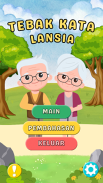
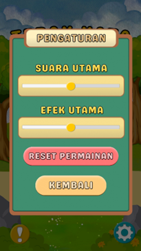
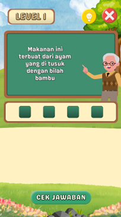
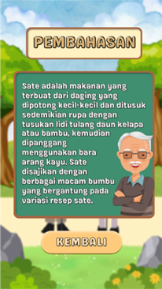

# Skripsi Unity Game — _Tebak Kata untuk Lansia_

Selamat datang di repositori skripsi game Tugas Akhir **Saya**.  
Game ini dikembangkan dengan **Unity** menggunakan bahasa **C#**, dan ditujukan untuk platform **Android**.

## Tentang Proyek

Game edukatif ini adalah bagian dari tugas akhir (skripsi) berjudul _“Perancangan Gim Tebak Kata Untuk Lansia”_. Game ini dirancang menggunakan metode ADDIE untuk membantu melatih kemampuan kognitif lansia secara interaktif. Hasil penelitian dapat dibaca di jurnal berikut:  
📖 [Perancangan Gim Tebak Kata Untuk Lansia (OJS Uniska)](https://ojs.uniska-bjm.ac.id/index.php/JIT/article/view/15336) :contentReference[oaicite:0]{index=0}

## Tujuan Repositori

Repositori ini menyediakan:

- **Script C#** — logika dan sistem game.
- **File .apk** (build Android demo) — agar game bisa langsung diuji coba.
- **Tanpa asset game** (gambar, audio, model) untuk melindungi hak cipta dan menjaga ukuran repo tetap ringan.

Game ini bisa digunakan sebagai bahan **belajar dan uji coba**, bukan untuk distribusi aset atau komersial.

---

## 📂 Isi Repo

- **/Scripts/** → Semua script C# yang digunakan
- **README.md** → Dokumentasi ini
- **Game.apk** → File APK untuk mencoba game

Script ini bisa ditempel ke project **Unity Android** milikmu, lalu digabung dengan aset sendiri untuk menjalankan game.

> ⚠️ **Catatan:** Asset game seperti gambar, musik, dan font **tidak disertakan** demi menjaga hak cipta.

---

## 📸 Preview Game (Screenshot)

| Tampilan Menu         | Tampilan Option            | Tampilan Game              | Tampilan Pembahasan       |
| --------------------- | -------------------------- | -------------------------- | ------------------------- |
|  |  |  |  |

---

## 📥 Cara Mencoba Game

1. Download file `Game.apk` dari [Release](#)
2. Install di perangkat Android (aktifkan **Install from Unknown Sources** jika perlu)
3. Mainkan dan nikmati! 🎯

---

## 🛠 Teknologi yang Digunakan

- Unity
- C#

---

## Teknologi yang Digunakan

- **Bahasa**: C#
- **Game Engine**: Unity (Platform: Android)
- **Metodologi Skripsi**: ADDIE (Analysis, Design, Development, Implementation, Evaluation)

## Kontak & Kolaborasi

Jika kamu tertarik berdiskusi, memberikan masukan, atau ingin mengembangkan fitur baru — silakan **buat Issue** atau **Pull Request**.  
Terima kasih atas perhatian dan dukunganmu!

## Lisensi & Penggunaan

- Script ini bersifat **open for learning and experimentation**.
- Dilarang digunakan untuk tujuan komersial tanpa izin tertulis dari pemilik.

---

